# Architektur-Übersicht — stele-e-transfer

> **Status:** Verifiziert durch tatsächliches Durchsuchen des Codes (nicht aus dem Gedächtnis geschrieben).
> **Stand:** 2026-08-19
> **Zweck:** Dies ist die einzige verbindliche Architektur-Dokumentation der App. Sie löst **P-33**
> (die per E-Mail verschickte `AGENT-RESTORE.md` war veraltet und widersprüchlich — Details in
> [Abschnitt 10](#10-p-33--was-war-das-problem-und-wie-ist-es-jetzt-gelöst)).
>
> Feature-Historie und Roadmap stehen weiterhin in [`P-UEBERSICHT.md`](../P-UEBERSICHT.md) — dieses
> Dokument beschreibt **wie** das System gebaut ist, nicht **was** wann gebaut wurde.

---

## 1. Überblick

**stele-e-transfer** ist eine Dropshipping-App für einen einzelnen eBay-DE-Shop
(Kleingewerbe §19 UStG, Wiesbaden). Sie importiert Produkte von AliExpress, generiert
deutsche eBay-Titel/-Beschreibungen per KI, listet sie auf eBay, überwacht Preise/Bestellungen
automatisiert und sichert sich selbst per E-Mail-Backup.

| Bereich | Technologie |
|---|---|
| Monorepo | Bun Workspaces + Turborepo |
| Backend | [Hono](https://hono.dev) (TypeScript) auf Bun, `.basePath('api')` |
| Frontend | React (SPA) + Vite + Wouter-Routing, unter `/api/*` vom selben Server bedient |
| Datenbank | Turso (libSQL, SQLite-kompatibel) via Drizzle ORM |
| Hosting | Render.com, Web Service, Auto-Deploy bei `git push` auf `main` |
| Auth | Signierte httpOnly-Session-Cookies (2 Benutzer aus ENV) + separater Cron-Key |
| E-Mail | Resend API (Fallback: Gmail SMTP via nodemailer) |
| KI | Google Gemini API (Titel/Beschreibung), Fallback-Textbausteine ohne KI |

Das Repo enthält zusätzlich `packages/desktop` (Electron) — **unbenutztes Sandbox-
Template-Gerüst** (Paketname noch `@template/desktop`), nicht Teil des produktiven
Systems und wird in diesem Dokument nicht weiter behandelt.
`packages/mobile` (Expo) war ebenfalls unbenutztes Template-Gerüst (0 Commits seit dem
initialen Scaffold, keine echte Store-Konfiguration, kein CI-Build) und wurde am
2026-08-20 komplett aus dem Repo entfernt.

---

## 2. Architektur-Diagramm

```mermaid
flowchart TD
    subgraph FE["🖥️ Frontend — packages/web/src/web (React SPA, app.tsx)"]
        direction TB
        FE_Login["Login (login.tsx)<br/>Session-Cookie-Check"]
        FE_Preise["💰 Preise (index.tsx)<br/>Preisrechner"]
        FE_Suche["🔍 Suche (suche.tsx)<br/>AliExpress-Suche"]
        FE_Import["📦 Import (lieferanten.tsx)<br/>größte Datei, 2018 Zeilen"]
        FE_Produkte["🗂️ Produkte (produkte.tsx)"]
        FE_Listings["🛒 Listings (listings.tsx)"]
        FE_Bestellungen["📬 Bestellungen (bestellungen.tsx)"]
        FE_Retouren["🔄 Retouren (retouren.tsx)"]
        FE_Einstellungen["⚙️ Einstellungen (einstellungen.tsx)"]
        FE_Dead["⚠️ toter Code:<br/>dashboard.tsx, autods.tsx<br/>(nirgends importiert)"]
    end

    subgraph BE["⚙️ Backend API — packages/web/src/api (Hono)"]
        direction TB
        BE_Auth["auth.ts<br/>/api/auth/*"]
        BE_Route["index.ts<br/>Route-Registry + Gemini-Textgenerierung<br/>+ Amazon-Scraper (legacy)"]
        BE_Ebay["ebay.ts (1608 Zeilen)<br/>/api/ebay/*"]
        BE_AliScrape["aliexpress.ts (1394 Zeilen)<br/>/api/aliexpress/scrape"]
        BE_AliApi["aliexpress-api.ts<br/>OAuth + DS-API"]
        BE_Drive["drive.ts<br/>/api/drive/*"]
        BE_Invoice["invoice.ts<br/>PDF-Generator (pdf-lib)"]
        BE_PriceMon["price-monitor.ts<br/>In-Process-Intervall alle 8h"]
        BE_OrderNotif["order-notifier.ts<br/>/api/orders/check"]
        BE_Backup["backup.ts (633 Zeilen)<br/>/api/backup/run"]
        BE_Mailer["mailer.ts<br/>Resend / Gmail-Fallback"]
    end

    DB[("🗄️ Turso / libSQL<br/>products · priceHistory · appSettings<br/>trustedSuppliers · orderNotes")]

    subgraph EXT["☁️ Externe Dienste"]
        direction TB
        Ext_Ebay["eBay APIs<br/>Trading · Inventory · Taxonomy<br/>Post-Order · Fulfillment"]
        Ext_AliDS["AliExpress DS-API<br/>(OAuth, offiziell)"]
        Ext_AliWeb["AliExpress Web<br/>(Scraping-Ziel)"]
        Ext_ScrapAnt["ScrapingAnt<br/>(Proxy + Headless-Rendering)"]
        Ext_Gemini["Google Gemini API"]
        Ext_Drive["Google Drive API"]
        Ext_Resend["Resend E-Mail API"]
    end

    subgraph OPS["🔁 Betrieb"]
        direction TB
        GH_Backup["GitHub Actions<br/>daily-backup.yml (02:00 UTC)"]
        GH_Orders["GitHub Actions<br/>order-check.yml (stündlich)"]
        Render["Render.com Hosting<br/>stele-e-transfer.onrender.com"]
    end

    %% Auth
    FE_Login -->|POST /api/auth/login| BE_Auth
    BE_Auth -.->|Session-Cookie schützt alle Routen| BE_Route

    %% Import-Flow
    FE_Import -->|POST /api/aliexpress/scrape| BE_AliScrape
    BE_AliScrape -->|1. Versuch: DS-API| Ext_AliDS
    BE_AliScrape -->|2. Playwright-Fallback*| Ext_AliWeb
    BE_AliScrape -->|3. ScrapingAnt-Fallback| Ext_ScrapAnt --> Ext_AliWeb
    FE_Import -->|Titel/Beschreibung generieren| BE_Route --> Ext_Gemini
    FE_Import -->|POST /api/products| BE_Route --> DB
    FE_Suche -->|Produktsuche| BE_AliApi --> Ext_AliDS

    %% Produkte/Listings
    FE_Produkte -->|GET/PATCH /api/products/*| BE_Route
    FE_Listings -->|POST /api/ebay/list<br/>GET /api/ebay/listings| BE_Ebay
    BE_Ebay --> Ext_Ebay
    FE_Bestellungen -->|GET /api/ebay/orders| BE_Ebay
    FE_Retouren -->|GET /api/ebay/returns| BE_Ebay

    %% Rechnung
    BE_Route -->|neue Bestellung → Rechnung| BE_Invoice
    BE_Invoice -->|PDF hochladen| BE_Drive --> Ext_Drive
    FE_Einstellungen -->|/api/drive/status, /api/aliexpress/status| BE_Drive
    FE_Einstellungen --> BE_AliApi

    %% Preis-Monitor
    BE_PriceMon -->|AliExpress-Preis lesen| Ext_AliDS
    BE_PriceMon -->|eBay-Preis schreiben| Ext_Ebay
    BE_PriceMon --> DB

    %% Order-Notifier
    BE_OrderNotif --> Ext_Ebay
    BE_OrderNotif --> BE_Mailer --> Ext_Resend

    %% Backup
    BE_Backup -->|DB-Export + Code-ZIP| DB
    BE_Backup --> BE_Mailer

    %% Cron / Hosting
    GH_Backup -->|X-Backup-Key Header| Render -->|weckt + triggert| BE_Backup
    GH_Orders -->|X-Backup-Key Header| Render -->|weckt + triggert| BE_OrderNotif

    style FE_Dead fill:#444,stroke:#f66,stroke-dasharray: 5 5,color:#fff
```

`*` Playwright-Fallback ist auf Render Free Tier faktisch tot (`ETXTBSY`-Fehler, siehe
[Abschnitt 9](#9-bekannte-schwachstellen--technische-schulden)) — ScrapingAnt trägt den
Scraping-Pfad in Produktion.

---

## 3. Frontend — Tabs (`packages/web/src/web/`)

Navigation und Tab-Reihenfolge sind zentral in `app.tsx` (`NAV_TABS`) definiert. Vor dem
Betreten der App läuft immer erst ein `GET /api/auth/me`-Check (`app.tsx`); ohne gültige
Session wird `login.tsx` gerendert.

| Tab | Datei | Zweck |
|---|---|---|
| 💰 Preise | `pages/index.tsx` | Eigenständiger Preisrechner (Gewinnformel, China-Zoll, Rundung) — unabhängig vom Produkt-Datensatz |
| 🔍 Suche | `pages/suche.tsx` | AliExpress-Produktsuche über die DS-API, mit EU/DE-Lager-Filter; bei API-Fehler externe Link-Fallbacks |
| 📦 Import | `pages/lieferanten.tsx` | **Kernstück des Imports**: AliExpress-URL → Scrape → Beschreibung/Titel generieren → Compliance-Check (P-66) → Mindestpreis-Vorschlag → in DB speichern, optional direkt bei eBay listen |
| 🗂️ Produkte | `pages/produkte.tsx` | Eigene Produktdatenbank, Preisänderungen, eBay-Status, Batch-Preisprüfung |
| 🛒 Listings | `pages/listings.tsx` | Alle eBay-Listings live von eBay + Abgleich mit App-DB, Massenaktionen (Preis/Beenden/Anzeigenrate/Kategorie) |
| 📬 Bestellungen | `pages/bestellungen.tsx` | eBay-Bestellungen, Tracking-Eingabe, Netto-Ergebnis-Berechnung, Rechnungs-Download |
| 🔄 Retouren | `pages/retouren.tsx` | eBay-Retouren, Erstattungs-Workflow |
| ⚙️ Einstellungen | `pages/einstellungen.tsx` | API-Verbindungsstatus (AliExpress-Token-Ablauf + Refresh-Button, Google Drive) |
| — | `pages/login.tsx` | Login-Formular |

**Gemeinsam genutzte Bausteine:**
- `lib/ebay-description.ts` (735 Zeilen) — baut die HTML-Beschreibungsvorlage ("Black & Gold"), von `lieferanten.tsx`, `produkte.tsx` und `api/index.ts` genutzt
- `shared/constants.ts` — `CHINA_ZOLL_EUR`, `MIN_GEWINN_EUR`, `SHOP_CATEGORIES` (Frontend **und** Backend importieren dieselbe Datei — keine Duplikation)
- `shared/regulated-categories.ts` — Keyword-Listen für den Compliance-Gate (P-66)

**Toter Code:** `pages/dashboard.tsx` und `pages/autods.tsx` existieren, sind aber in `app.tsx`
nicht geroutet und werden von keiner anderen Datei importiert (verifiziert per Volltextsuche).
Vermutlich Überbleibsel aus der Zeit vor dem eBay-Redesign bzw. vor Kündigung von AutoDS
(siehe `P-UEBERSICHT.md`: „AutoDS gekündigt 2026-06-28").

---

## 4. Backend — API-Module (`packages/web/src/api/`)

Alle Routen laufen unter `.basePath('api')` — jede Route ist nur unter `/api/...` erreichbar,
nicht unter der nackten Pfad-Angabe im Code. `server.ts` leitet ausschließlich `/api/*` und
`/backup/*` an Hono weiter, alles andere liefert die gebaute SPA (`dist/index.html`) aus.

| Datei | Zeilen | Zuständigkeit | Wichtige Routen |
|---|---|---|---|
| `auth.ts` | 87 | Login/Logout, Session-Middleware, Cron-Key-Ausnahme | `POST /auth/login`, `GET /auth/me`, `POST /auth/logout` |
| `index.ts` | 2774 | Route-Registry (fast alle Endpunkte), Gemini-Titel-/Beschreibungsgenerierung, Amazon-Scraper (Legacy-Reserve) | `/products/*`, `/ebay/listings/*`, `/ebay/orders/*`, `/order-notes/*`, `/upload-*` |
| `ebay.ts` | 1608 | eBay OAuth, Inventory/Trading/Taxonomy/Post-Order-API-Wrapper | Funktionen wie `listOnEbay`, `getAllSellerListings`, `getAllOrders`, `reviseListingContent` |
| `aliexpress.ts` | 1394 | Produkt-Scraper: DS-API → Playwright → ScrapingAnt → Roh-HTML, in dieser Reihenfolge | `scrapeAliExpressUrl()` |
| `aliexpress-api.ts` | 453 | Offizielle AliExpress DS-API (OAuth-Token-Verwaltung, Produkt-/Fracht-Abfrage) | `getAliProductByApi()`, `refreshAliToken()` |
| `drive.ts` | 274 | Google Drive OAuth, Datei-Upload, signierter Bild-/PDF-Proxy | `GET /drive/callback`, `GET /drive/file/:fileId` |
| `invoice.ts` | 118 | Rechnungs-PDF-Erzeugung (pdf-lib, kein Headless-Browser nötig) | `generateInvoicePdf()` |
| `price-monitor.ts` | 301 | Preisformel + automatischer eBay-Preis-Abgleich, alle 8h | `calcSellPrice()`, `runPriceCheck()` |
| `order-notifier.ts` | 123 | Neue-Bestellung-E-Mail-Benachrichtigung, dedupliziert | `checkAndNotifyNewOrders()` |
| `backup.ts` | 633 | DB-Backup (CSV+JSON+Code-ZIP) 2×/Tag per E-Mail | `runBackup()`, `generateAgentRestoreMd()` |
| `mailer.ts` | 65 | E-Mail-Versand-Abstraktion: Resend zuerst, Gmail-SMTP als Fallback | `sendBackupEmail()` |
| `backup-cron.ts` | 11 | Dünner CLI-Runner für lokalen manuellen Backup-Test | — |

Zwei Hintergrund-Loops laufen **im selben Prozess** wie der Webserver (`server.ts` startet sie
beim Boot): `startPriceMonitor()` und `startOrderNotifier()`, plus `startBackupScheduler()`.
Das bedeutet: Ein Render-Free-Tier-Kaltstart (durch Inaktivität) setzt diese Intervalle zurück
— deshalb weckt jeder GitHub-Actions-Cron-Lauf den Server zuerst per `/api/health`-Polling,
bevor er den eigentlichen Endpunkt triggert.

---

## 5. Datenbank (Turso / libSQL, `packages/web/src/db/schema.ts`)

| Tabelle | Zweck | Bemerkenswerte Felder |
|---|---|---|
| `products` | Zentrale Produkttabelle | `shipsFrom`, `adRate`, `variantPrices`/`variantContents` (JSON), `gpsrName/Address/City/Email/Phone` (strukturiertes GPSR, aber **noch nicht automatisch befüllt** — siehe `task.md` TODO #1), `manualPdfUrl`, `certificationNote` |
| `priceHistory` | Preisverlauf pro Produkt | `source`: `aliexpress` \| `manual` |
| `appSettings` | Key-Value-Store | hält AliExpress-OAuth-Tokens (Access/Refresh/Expiry) |
| `trustedSuppliers` | "Meine Shops" (manuell erfasste, EU-bestätigte AliExpress-Shops) | `complianceStatus` (P-66: `ungeprueft`/`geprueft`/`abgelehnt`) — **noch ohne Import-Gate**, nur Erfassung |
| `orderNotes` | App-eigene Zusatzinfos zu eBay-Bestellungen | `manualBuyPrice` (hat Vorrang vor automatischem SKU-Match), `invoicePath`, `aliexpressOrderId` |

Migrationen laufen automatisch beim Serverstart (`db/migrate.ts`, aufgerufen aus `server.ts`).

---

## 6. Externe Integrationen

| Dienst | Datei(en) | Zweck | Auth |
|---|---|---|---|
| **eBay APIs** | `ebay.ts` | Listing erstellen/ändern, Preise, Bestellungen, Retouren, Kategorie-Vorschlag | OAuth User-Token (Refresh in ENV) |
| **AliExpress DS-API** | `aliexpress-api.ts` | Offizieller Produkt-/Fracht-Abruf | OAuth, Token in DB (`appSettings`) mit Auto-Refresh 3 Tage vor Ablauf |
| **AliExpress Scraping** | `aliexpress.ts` | Fallback wenn DS-API keine Daten liefert (Varianten, Bilder) | kein Auth, über ScrapingAnt-Proxy |
| **ScrapingAnt** | `aliexpress.ts` | Residential-DE-Proxy + Headless-Rendering für AliExpress-Seiten | API-Key in ENV |
| **Google Gemini** | `api/index.ts` (`generateDescriptionWithGemini`, `generateGermanTitle`) | Deutsche eBay-Titel/-Beschreibungen; Fallback-Textbausteine ohne KI-Aufruf bei fehlendem Key oder 503 | API-Key in ENV |
| **Google Drive** | `drive.ts` | Backup-/Rechnungs-Ablage, Bild-/Datei-Proxy für eBay-Hotlinking | OAuth, signierter `?sig=`-Token pro Datei (Ersatzschutz, da Proxy öffentlich erreichbar sein muss) |
| **Resend** | `mailer.ts`, `backup.ts` | Backup-Mails, Bestellbenachrichtigungen | API-Key in ENV, Fallback Gmail-SMTP |
| **GitHub Actions** | `.github/workflows/daily-backup.yml`, `order-check.yml` | Weckt Render (Free-Tier-Schlaf) + triggert `/api/backup/run` und `/api/orders/check` per `X-Backup-Key`-Header | `BACKUP_API_KEY` (Secret) |
| **Render.com** | `render.yaml` | Hosting, Auto-Deploy bei Push auf `main` | — |

---

## 7. Auth & Security

- Zwei feste Benutzer aus ENV (`AUTH_USER1_NAME/PASS`, `AUTH_USER2_NAME/PASS`) — kein
  Registrierungs-Flow.
- Session: signiertes httpOnly-Cookie (`SESSION_SECRET`), 30 Tage gültig, `secure` nur wenn
  `RENDER=true` gesetzt ist (lokal über HTTP nutzbar).
- `authMiddleware` schützt **alle** `/api/*`-Routen außer `/drive/callback` und `/drive/file/:fileId`
  (Google kann beim OAuth-Callback kein Cookie mitschicken; der Bild-Proxy muss für eBay ohne
  Cookie erreichbar sein — dafür der separate `?sig=`-Schutz, siehe oben).
- Automatisierte Cron-Aufrufe (`/backup/run`, `/orders/check`) laufen **nicht** über die
  Session, sondern über einen eigenen `X-Backup-Key`-Header-Vergleich.
- Fehlt `SESSION_SECRET` in der Umgebung, lehnt die Middleware **alle** Aufrufe mit 500 ab
  (fail-closed, kein stiller Auth-Bypass).

---

## 8. Deploy & Betrieb

- **Aktiver Deploy-Weg laut `render.yaml`:** `env: node` (kein Docker), Build: `bun install && bun run build`, Start: `bun src/server.ts`.
- Es liegt zusätzlich ein `Dockerfile` im Root, das Google Chrome installiert und `PLAYWRIGHT_AVAILABLE=true` setzt — dieser Pfad wird von `render.yaml` **nicht** referenziert (siehe Schwachstelle unten).
- Statische Assets werden vom selben Bun-Server ausgeliefert wie die API (`server.ts`
  unterscheidet nach Pfad-Präfix).

---

## 9. Bekannte Schwachstellen / technische Schulden

Verankert an der jeweiligen Architektur-Stelle. Referenzen auf `P-UEBERSICHT.md` wo vorhanden;
zusätzlich Funde aus Code-Kommentaren und dieser Code-Durchsuchung.

### Frontend
- **Toter Code:** `dashboard.tsx`, `autods.tsx` — nicht geroutet, sollten entfernt oder reaktiviert werden.
- **Vorschau-Modal nicht editierbar** (offene Idee in `P-UEBERSICHT.md`): Produkte-Tab erlaubt kein direktes Bearbeiten von Text/Bullets im Modal.
- **GPSR-Felder nicht automatisch befüllt** (`task.md` TODO #1): Schema hat strukturierte GPSR-Felder (`gpsrName` etc.), aber `ae_store_info`-Herstellerdaten aus der API-Antwort werden noch nicht automatisch geparst.

### Scraping / AliExpress
- **Playwright auf Render Free Tier faktisch tot** (`ETXTBSY`-Fehler laut `P-UEBERSICHT.md`) — der in `aliexpress.ts` codierte Fallback-Pfad 2 (Playwright) greift in Produktion nie; ScrapingAnt trägt allein. `Dockerfile` installiert Chrome für genau diesen Pfad, wird aber laut `render.yaml` nicht genutzt — die zwei Deploy-Konfigurationen widersprechen sich.
- **`affiliate.product.query` permanent blockiert** (`InsufficientPermission`, nicht ohne neue AliExpress-App-Genehmigung fixbar).
- **EU-Lager-Filter nur beim Import**, nicht in der Such-Ergebnisliste (`shipFromCountry` fehlt in ScrapingAnt-Suchergebnissen) — offene Idee in `P-UEBERSICHT.md`.

### Preise
- **Keine automatische Preisaktualisierung außerhalb des 8h-Zyklus** — offene Idee „Preisaktualisierung Cron-Job" in `P-UEBERSICHT.md` überschneidet sich teilweise mit dem bereits gebauten `price-monitor.ts`; Abgleich zwischen Idee und Ist-Stand wäre sinnvoll.
- Preisformel (`calcSellPrice`) ist an zwei Stellen dupliziert (`price-monitor.ts` und `lieferanten.tsx`, laut Code-Kommentar "gleiche Formel") — Änderungsrisiko bei künftigen Anpassungen (z.B. die für Ende 2026 angekündigte EU-Handling-Fee, siehe `shared/constants.ts`).

### Compliance (P-66)
- `trustedSuppliers.complianceStatus` wird erfasst, aber **es gibt noch kein Import-Gate**, das ungeprüfte Lieferanten blockiert — reine Datenerfassung bisher.

### GitHub-Actions-Abhängigkeit
- Preis-Monitor, Order-Notifier und Backup-Scheduler laufen zwar in-process, sind aber auf Render Free Tier vom periodischen externen Aufwecken durch GitHub Actions abhängig (Kaltstart bei Inaktivität setzt In-Memory-Intervalle zurück).

### KI
- **Gemini gelegentlich überlastet** (503) — Fallback-Textbausteine greifen automatisch, liefern aber spürbar generischere Beschreibungen.

### Dokumentation
- **P-33 (dieses Dokument):** `backup.ts` verschickte bislang eine fest einprogrammierte, mit der Zeit driftende "Restore-Anleitung" — siehe Abschnitt 10.
- **P-Nummerierung uneinheitlich:** `P-UEBERSICHT.md` ist als "einzige Quelle der Wahrheit" deklariert, listet aber nur bis P14 + benannte Ideen, während Code-Kommentare bereits P-15 bis P-75 referenzieren (u.a. P-66 Compliance-Gate, P-69 Versandkosten-Zentralisierung, P-73 Bewertungs-Ampel, P-74/75 Preisrundung) — diese Features sind gebaut, aber nicht in `P-UEBERSICHT.md` nachgetragen.

---

## 10. P-33 — Was war das Problem, und wie ist es jetzt gelöst?

**Das Problem:** Es gibt keine Datei `AGENT-RESTORE.md` im Repository. Was den Namen trug, war
in Wirklichkeit `generateAgentRestoreMd()` in `backup.ts` — eine zur Laufzeit generierte
Markdown-Anleitung, die bei jedem der zwei täglichen Backups per E-Mail verschickt wird. Der
Text darin war jedoch größtenteils **statisch einprogrammiert** und stammte erkennbar aus der
Zeit um den Go-Live (29.06.2026). Verifizierte Widersprüche zum tatsächlichen Code (Stand
dieses Dokuments):

- Preisformel im Text: `sellPrice = buyPrice / (1 - 0.18) + 1.60`. Tatsächliche Formel in
  `price-monitor.ts`: Mindestgewinn ist **2,00 €** (seit 14.07.2026) statt 1,60 €, und es fehlt
  komplett der China-Zoll-Posten (`CHINA_ZOLL_EUR`, aktuell 4,00 €, seit 27.07.2026).
- DB-Schema im Text zeigt nur `products`/`price_history` mit einer Handvoll Feldern — real
  existieren 5 Tabellen, `products` hat u.a. `shipsFrom`, `adRate`, GPSR-Felder, `ean`, die im
  Text fehlen.
- Datei-/Tab-Baum im Text listet 7 Seiten ohne `bestellungen.tsx` und ohne die reale
  Tab-Reihenfolge aus `app.tsx`.
- Integrations-Status-Tabelle im Text: „Trackerbot ✅ aktiv" — laut `P-UEBERSICHT.md` seit
  02.07.2026 gekündigt.
- „Aktuelle TODOs" im Text sind größtenteils bereits erledigt (z.B. Preis-Cron existiert längst
  als `price-monitor.ts`).

Diese Datei wurde also mit jedem Backup verschickt, ohne je aktualisiert zu werden — genau die
"veraltet und widersprüchlich"-Situation aus P-33.

**Die Lösung:**
1. Dieses Dokument (`docs/ARCHITECTURE.md`) ist ab sofort die verbindliche, gepflegte
   Architektur-Referenz und wird bei strukturellen Änderungen aktualisiert (siehe Abschnitt 11).
2. `generateAgentRestoreMd()` in `backup.ts` wurde umgebaut: Die architektonischen Fakten
   (Schema, Routen, Tech-Stack-Details, Integrations-Status) wurden aus dem generierten Text
   entfernt und durch einen Verweis auf `docs/ARCHITECTURE.md` ersetzt — die reinen
   Wiederherstellungs-**Schritte** (Code aus ZIP entpacken, `bun install`, ENV setzen, DB
   pushen, deployen) bleiben erhalten, da sie sich nicht mit dem Code ändern.
3. `docs/ARCHITECTURE.md` wird jetzt zusätzlich in den Backup-Code-ZIP aufgenommen
   (`generateCodeZip()` in `backup.ts`), sodass jede Backup-Mail automatisch die aktuelle
   Version dieses Dokuments mitschickt — ein Notfall-Restore hat damit immer den Ist-Stand zur
   Hand, statt eines eingefrorenen Snapshots.

---

## 11. Pflegehinweis

Dieses Dokument spiegelt den Code-Stand vom 2026-08-19 wider. Bei strukturellen Änderungen
bitte aktualisieren:
- neue/entfernte Tabs → Abschnitt 3 + Diagramm
- neue/entfernte API-Module oder externe Integrationen → Abschnitt 4/6 + Diagramm
- Schema-Änderungen → Abschnitt 5
- neue P-Nummer mit architektonischer Relevanz → ggf. Abschnitt 9 ergänzen

Es ersetzt **nicht** `P-UEBERSICHT.md` (Feature-Liste/Roadmap) oder `task.md`
(Session-Fortschritt) — diese drei Dokumente haben unterschiedliche Zwecke und sollten nicht
zusammengeführt werden.
